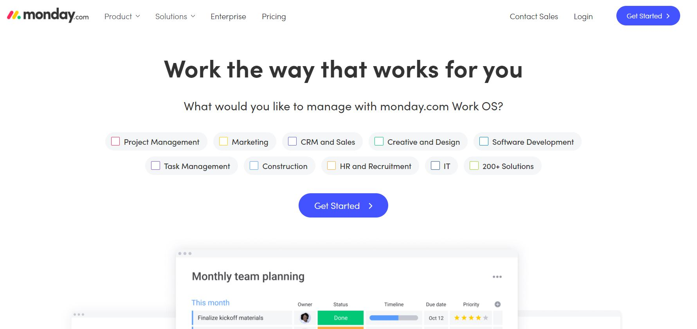
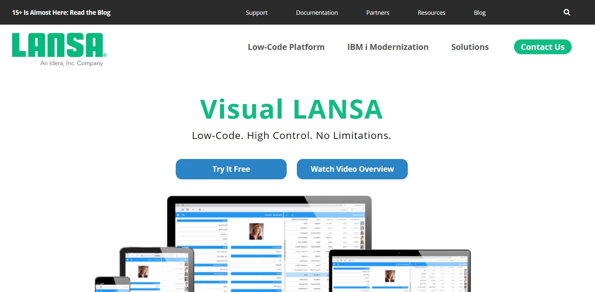
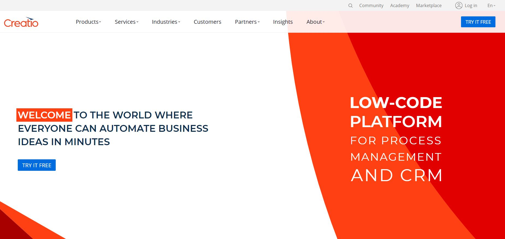
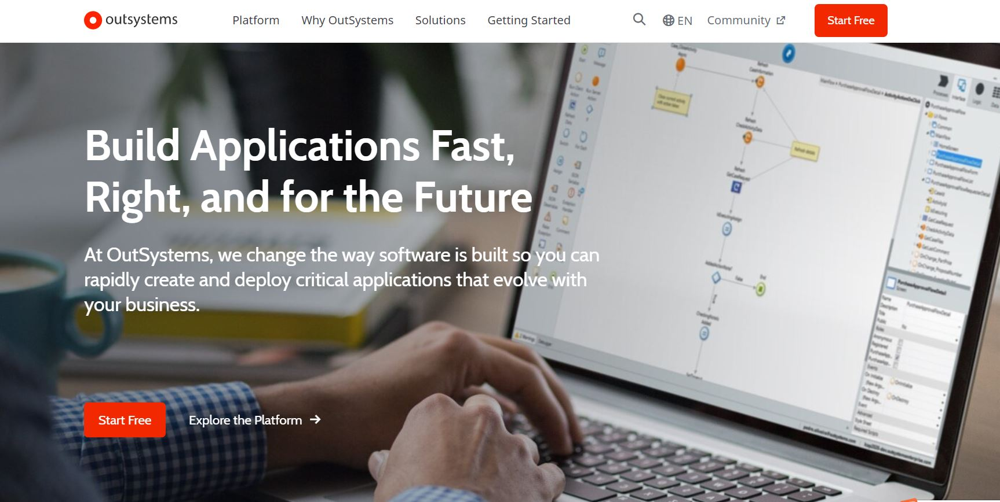
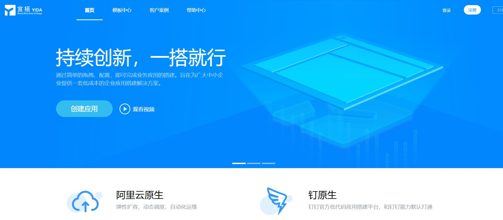

# 什么是低代码

## 概念

低代码开发平台（LCDP）提供了一个开发环境，该开发环境通过图形用户界面和配置代替传统的人工代码开发，来创建软件。低代码模型使经验水平各异的开发人员可以使用可视用户界面结合模型驱动的逻辑来创建应用程序。这样的平台可能会产生完全可运行的应用程序，或者针对特定情况需要进行额外的编码。

## 好处
1、低代码开发工具提供了许多好处，并且更多的人可以为应用程序开发过程做出贡献。 此外，这些平台还可以帮助组织提高敏捷性。它降低了应用程序开发过程的复杂性。

2、低代码平台还有另外两个重要好处，即高生产率和低成本，因为它可以在更短的时间内开发更多的应用程序。

3、根据frevvo进行的研究，它可以将数字化转换转型速度提高69％，并将减少40%对高技术技能的依赖。

## 一些典型低代码开发平台
1、monday.com

https://monday.com/

快速创建适合任何业务需求的应用程序。

2、Visual LANSA

https://lansa.com/

低代码>>高控制

3、Creatio

https://www.creatio.com/

每个人都可以在数分钟内自动实现商业创意。

4、Mendix

https://www.mendix.com/

低代码应用开发平台。

5、OutSystems

https://www.outsystems.com/

快速构建企业级应用程序。

6、阿里-宜搭

https://www.aliwork.com/

## 参考资料
1、[Low-code development platform](https://en.wikipedia.org/wiki/Low-code_development_platform)

2、[The Low-Code/No-Code Movement: More Disruptive Than You Realize](https://www.forbes.com/sites/jasonbloomberg/2017/07/20/the-low-codeno-code-movement-more-disruptive-than-you-realize/?sh=30074474722a)

3、[https://www.softwaretestinghelp.com/low-code-development-platforms/](https://www.softwaretestinghelp.com/low-code-development-platforms/)

4、[awesome-lowcode](https://github.com/taowen/awesome-lowcode)

