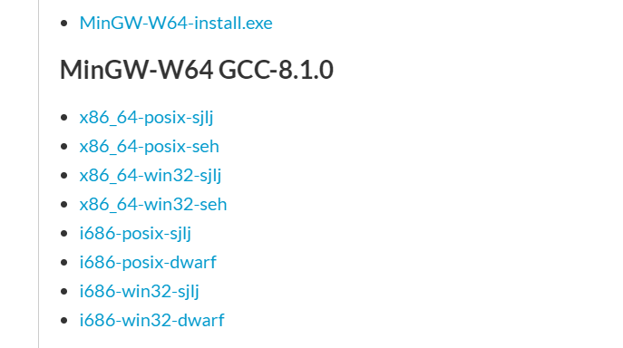
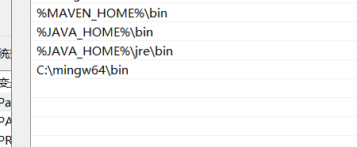
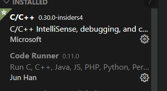

# vscode运行c++

## 安装gcc

在下面这个链接，下载g++
https://sourceforge.net/projects/mingw-w64/files/

解压到某个路径下，我安装到：C:\mingw64\bin

然后加入到环境变量中。

cmd中验证

## 安装扩展

> c/c++扩展,又名 cpptools,提供debug和Format功能

> codeRuner扩展

## 其他工具
>Bracket Pair Colorizer 2：彩虹花括号

>One Dark Pro：大概是VS Code安装量最高的主题

