# Hello world 鸿蒙OS App小实践

今天华为开发者大会发布了Harmony OS 2.0, 作为一个搬砖工，自然也不能落后，也来玩一玩鸿蒙系统。

## 鸿蒙OS网站
首先进入进入开发者联盟网站，找到鸿蒙OS。

https://developer.huawei.com/consumer/cn/

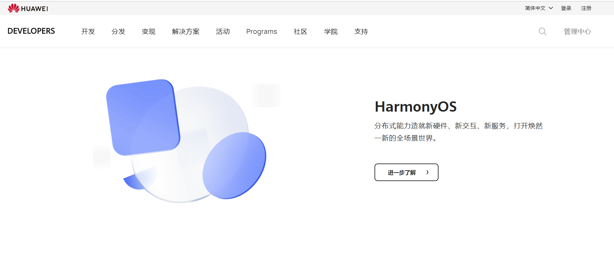

点击进一步了解，[鸿蒙OS网站](https://www.harmonyos.com/cn/home)

## 小试牛刀

（1）注册华为开发者账号

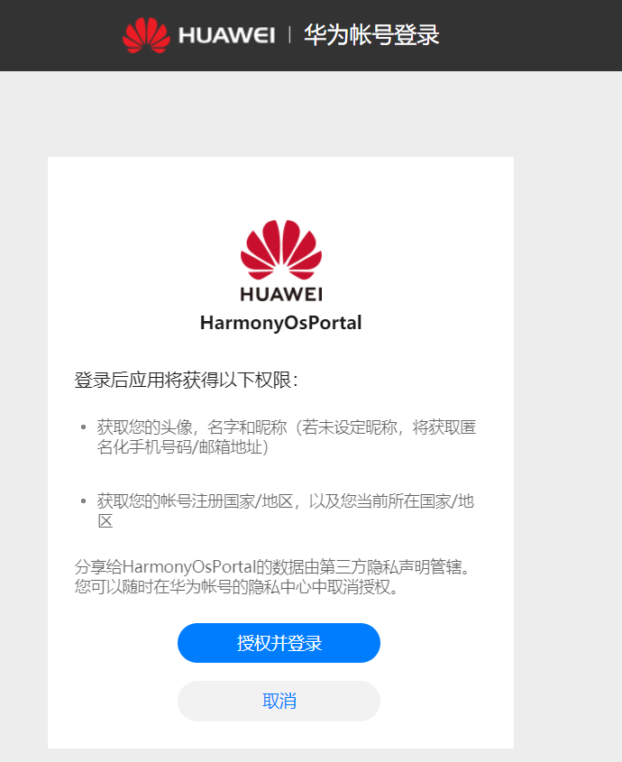

（2）下载DevEco Studio

网址：https://developer.harmonyos.com/cn/develop/deveco-studio

点击立即下载：

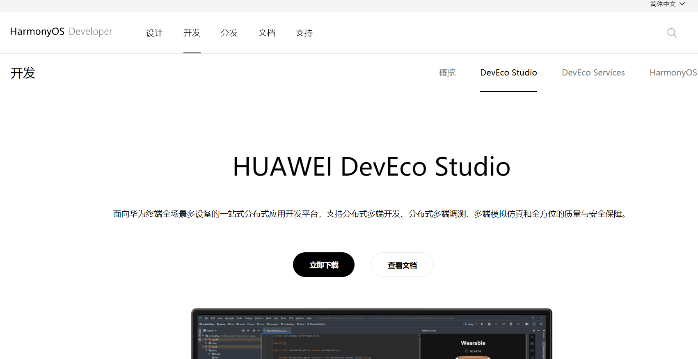

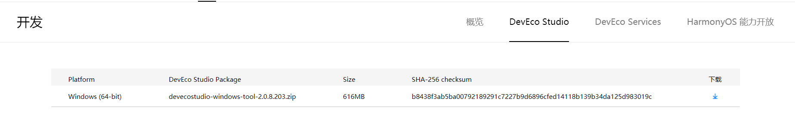

一共616MB，还是有点大的。

（3）安装IDE

点击exe进行安装，一路next。

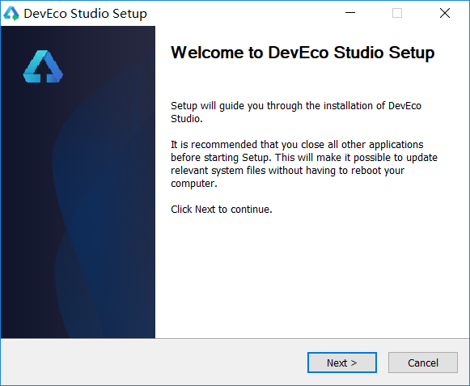

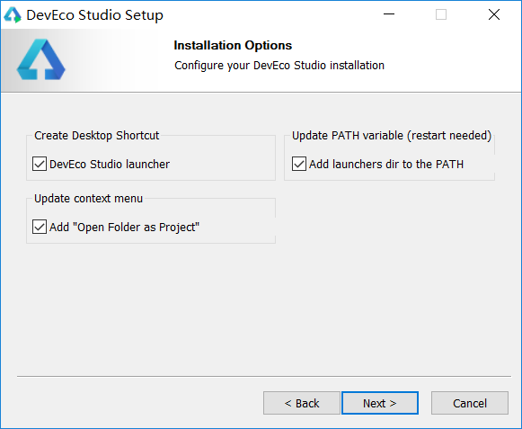

（4）配置开发环境

首先，打开IDE的时候，需要下载toolchain和java sdk
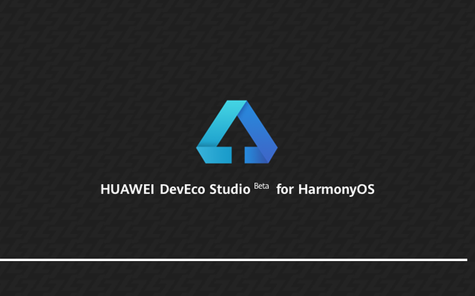

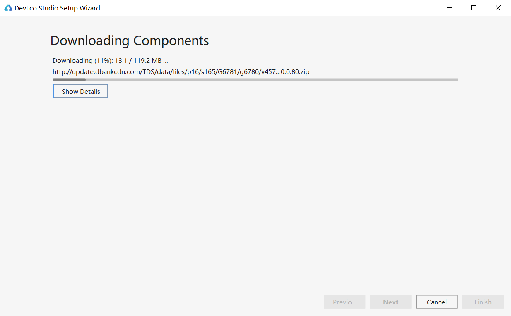

下载SDK。

Configure -> Settings -> Appearance & Behavior ->  System Settings -> HarmonyOS SDK -> SDK(API Version 3)

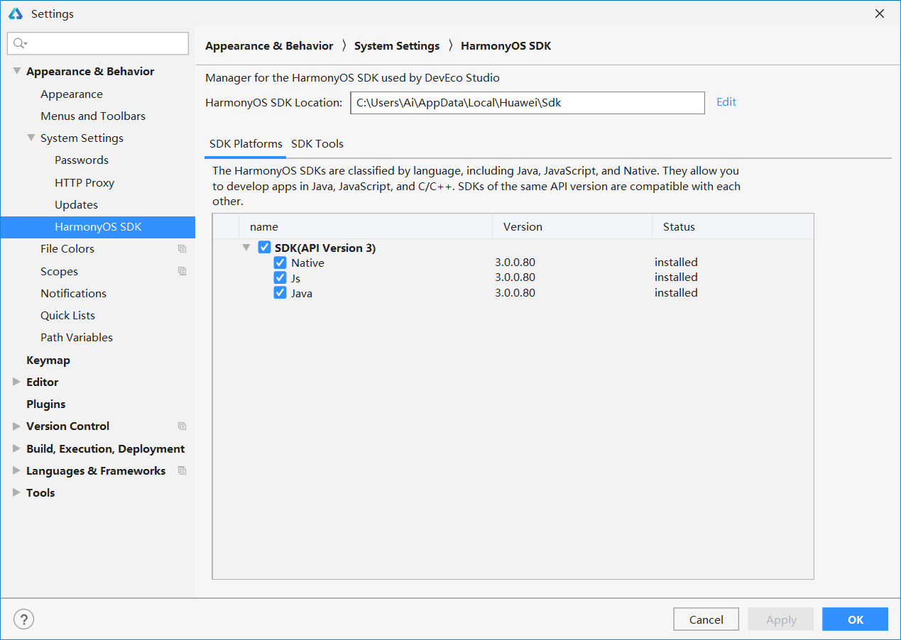

点击Apply就会开始下载了

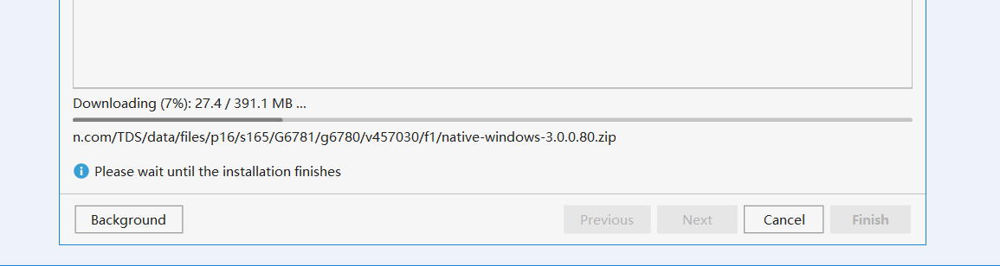

（5）第一个Harmony OS 程序： **Hello World**

创建新工程，选择ability template，按照官网，我选择的是Wearable。

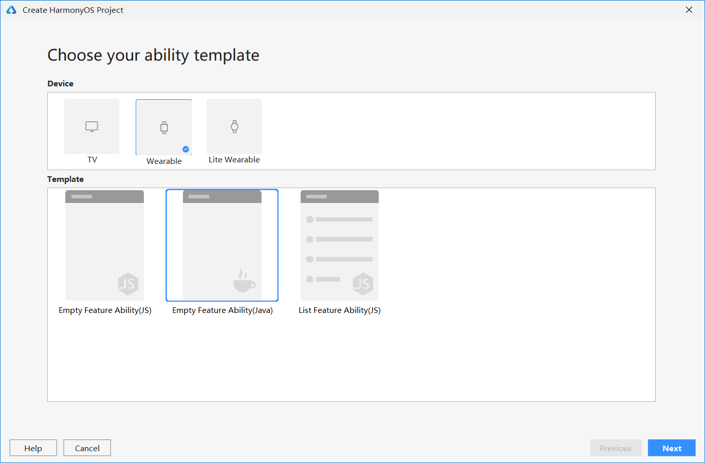

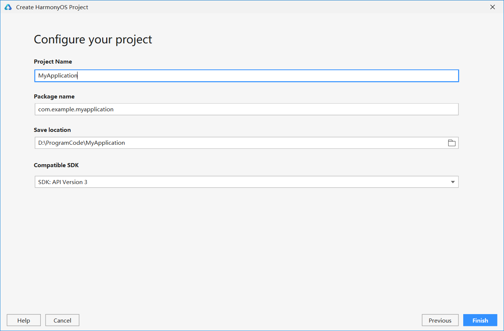

代码目录如下：

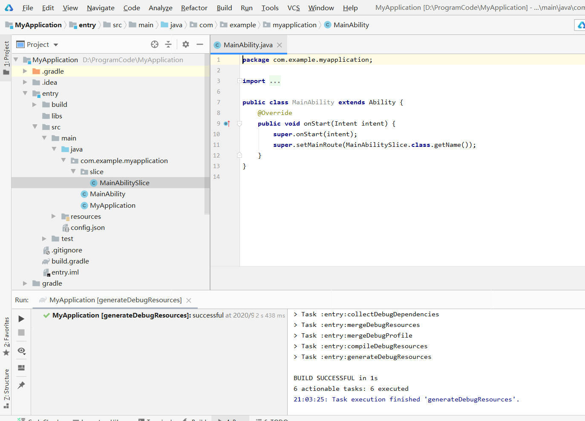

废了九牛二虎之力，模拟器终于下载下来。然后运行程序。
点击HPV，会转到华为开发者联盟网站。

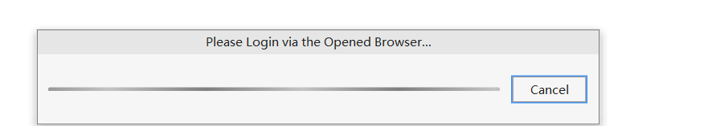

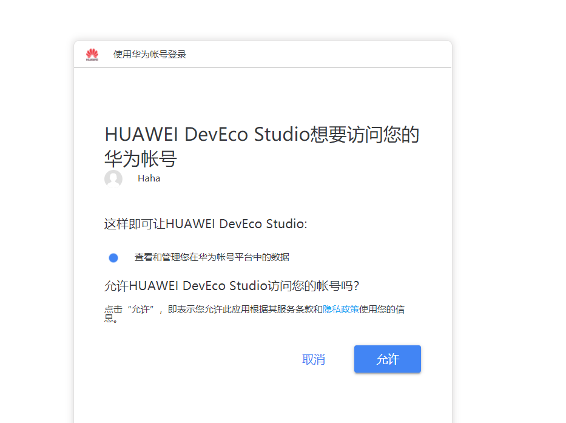

点击允许，会提示已经成功登录客户端。

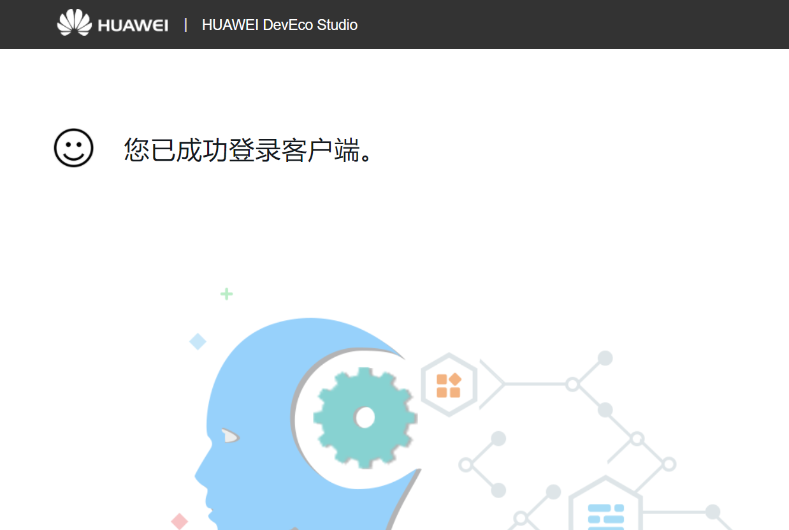

IDE页面点击Agree

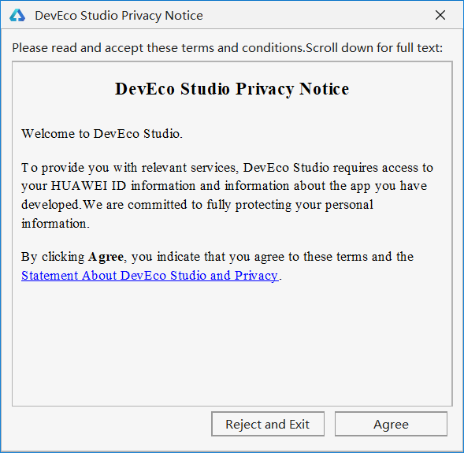

然后会弹出Device Manager，Actions中运行。

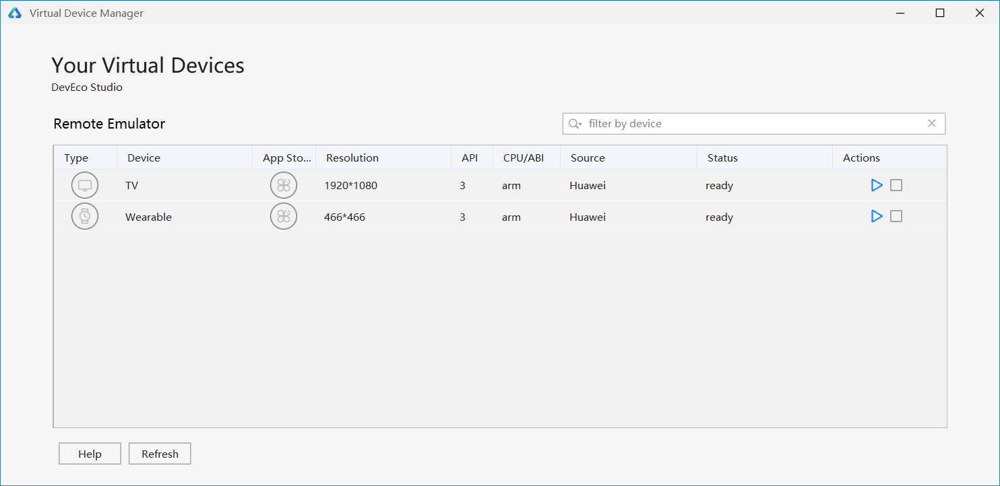

弹出模拟器。

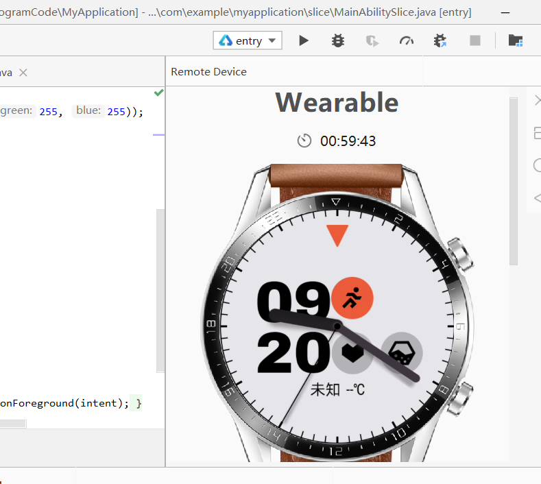

Run Entry运行工程，选择Target。

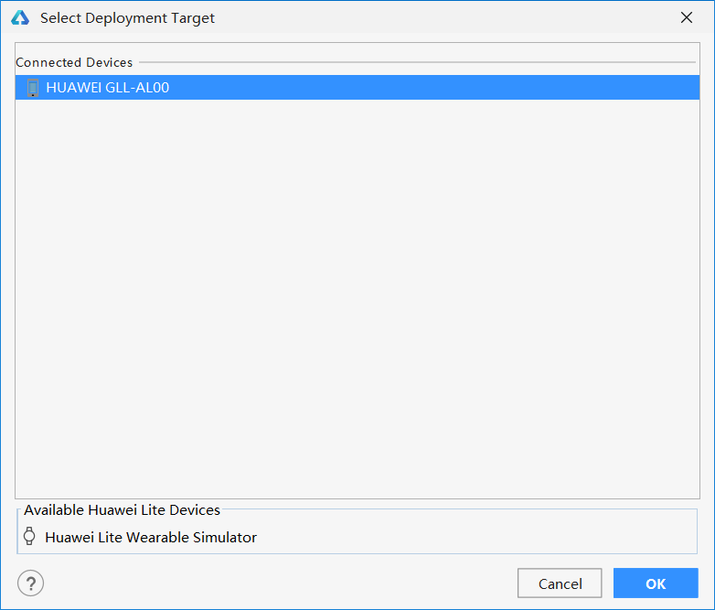

点击OK，运行完成后，手表就出现了Hello World。

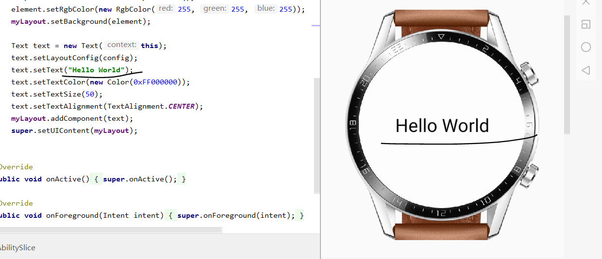

