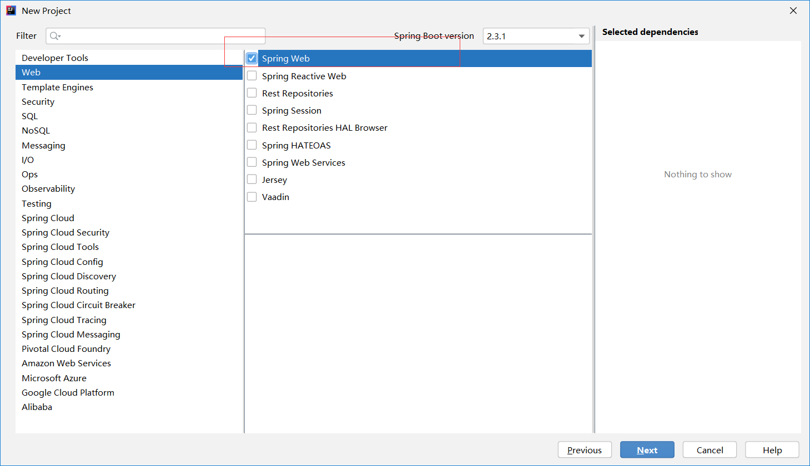

# SpringBoot实践

## 1 SpringBoot入门
1、SpringBoot简介
* 简化Spring应用开发的一个框架
* 整个Spring技术栈思维一个大整合
* J2EE开发的一站式解决方案

2、微服务 MicroService
* 一个应用是一组小型服务；可以通过HTTP的方式进行交互
* 每一个功能元素最终都是一个可独立替换和独立升级的软件

SpringBoot可以快速构建一个微服务单元

3、环境
- jdk 1.8: SpringBoot推荐1.7以上
- maven3.x maven 3.3以上版本
- IDEA 2017
- SpringBoot 1.5.9.RELEASE

## 2 SpringBoot实践
### 2.1 springboot hello world
1、创建Maven项目

step1 设置maven


step2 创建项目


step3 设置项目名称以及路径


step4 创建成功


2、导入springboot依赖

SpringBoot官网

https://spring.io/projects/spring-boot#overview

https://spring.io/guides/gs/rest-service/

在pom.xml中添加：

``` 
    <parent>
        <groupId>org.springframework.boot</groupId>
        <artifactId>spring-boot-starter-parent</artifactId>
        <version>2.2.2.RELEASE</version>
        <relativePath/> <!-- lookup parent from repository -->
    </parent>

    <dependencies>
        <dependency>
            <groupId>org.springframework.boot</groupId>
            <artifactId>spring-boot-starter-web</artifactId>
        </dependency>
    </dependencies>
```

导入完毕：


3、编写主程序以及Control部分

主程序
```
@SpringBootApplication
public class HelloWorldMainApplication {

    public static void main(String[] args){
        // Spring应用启动
        SpringApplication.run(HelloWorldMainApplication.class, args);
    }
}
```

Control部分
```
@Controller
public class HelloController {

    @ResponseBody
    @RequestMapping("/hello")
    public String hello(){
        return "hello world";
    }
}
```

4、运行结果

控制台输出：


浏览器输入地址: http://localhost:8085/hello


5、简化部署

通过插件将应用打包成可执行的jar包

pom.xml中添加：

```
    <build>
        <plugins>
            <plugin>
                <groupId>org.springframework.boot</groupId>
                <artifactId>spring-boot-maven-plugin</artifactId>
            </plugin>
        </plugins>
    </build>
```

执行生命周期中的打包：


打包成jar包后，执行java -jar


---

### 2.2 HelloWorld探究
1、场景启动器starters
```
    SpringBoot将所有功能场景抽取出来为一个个pom启动器，帮助导入正常运行所需要的依赖。
```
参考：https://docs.spring.io/spring-boot/docs/2.2.2.RELEASE/reference/html/

2、主程序类、主入口
```
@SpringBootApplication
public class HelloWorldMainApplication {

    public static void main(String[] args){
        // Spring应用启动
        SpringApplication.run(HelloWorldMainApplication.class, args);
    }
}
```

@SpringBootApplication 标注在某个类上面，说明这个类是SpringBoot的主配置类，Spring应该运行这个类的main方法来启动SpringBoot应用。
```
@Target({ElementType.TYPE})
@Retention(RetentionPolicy.RUNTIME)
@Documented
@Inherited
@SpringBootConfiguration
@EnableAutoConfiguration
@ComponentScan(
    excludeFilters = {@Filter(
    type = FilterType.CUSTOM,
    classes = {TypeExcludeFilter.class}
), @Filter(
    type = FilterType.CUSTOM,
    classes = {AutoConfigurationExcludeFilter.class}
)}
)
public @interface SpringBootApplication {
```

(1)第一个注解： **@SpringBootConfiguration**

@SpringBootConfiguration SpringBoot的配置类。标注在某个类上，表示这是一个SpringBoot的配置类。

@Configuration :标注在配置类。配置类也是容器中的一个组件。@Component

(2)第二个注解： **@EnableAutoConfiguration**

@EnableAutoConfiguration 用于开启自动配置功能。


@Import({AutoConfigurationPackages.Registrar.class}) Spring的底层注解@import,给容器导入一个组件。将主配置类（@SpringBootApplication标注）的类的所有包以及下面所有子包里面所有的组件扫描到Spring容器。


@Import({AutoConfigurationImportSelector.class})  导入哪些组件的选择器；将需要导入的组件以全类名的方式返回；这些组件就会被添加到容器中;会给容器中导入非常多的自动配置类（xxxAutoConfiguration）；给容器导入这个场景需要的所有组件，并配置好这些组件。


免去手动编写配置注入功能组件等工作。
SpringFactoriesLoader.loadFactoryNames(EnableAutoConfiguration.class,classLoader)

SpringBoot在启动的时候从类路径下META-INF/spring.factories中获取enableConfiguration指定的值，将这些值作为自动配置的类导入到容器中，自动配置类就生效，帮助我们进行配置工作。


J2EE的整体解决方案和自动配置都在spring-boot-autoconfigure-2.2.2.RELEASE.jar

---

### 2.3 使用SpringInitilalizer创建SpringBoot项目

#### step1 下载插件

Setting中在Plugins中安装Spring Assistant


#### step2 使用Spring Assistant创建项目




 

默认生成的SpringBoot项目包含：
* 主程序
* resoucrces文件夹
 > static静态资源;

 > temnplates模板页面;

 > applications.properties: SpringBoot应用的配置文件

 

 ```
 <?xml version="1.0" encoding="UTF-8"?>
<project xmlns="http://maven.apache.org/POM/4.0.0" xmlns:xsi="http://www.w3.org/2001/XMLSchema-instance"
	xsi:schemaLocation="http://maven.apache.org/POM/4.0.0 https://maven.apache.org/xsd/maven-4.0.0.xsd">
	<modelVersion>4.0.0</modelVersion>
	<parent>
		<groupId>org.springframework.boot</groupId>
		<artifactId>spring-boot-starter-parent</artifactId>
		<version>2.3.1.RELEASE</version>
		<relativePath/> <!-- lookup parent from repository -->
	</parent>
	<groupId>com.example</groupId>
	<artifactId>spring-boot-01-helloworld-quick</artifactId>
	<version>0.0.1-SNAPSHOT</version>
	<name>spring-boot-01-helloworld-quick</name>
	<description>Demo project for Spring Boot</description>

	<properties>
		<java.version>1.8</java.version>
	</properties>

	<dependencies>
		<dependency>
			<groupId>org.springframework.boot</groupId>
			<artifactId>spring-boot-starter-web</artifactId>
		</dependency>

		<dependency>
			<groupId>org.springframework.boot</groupId>
			<artifactId>spring-boot-starter-test</artifactId>
			<scope>test</scope>
			<exclusions>
				<exclusion>
					<groupId>org.junit.vintage</groupId>
					<artifactId>junit-vintage-engine</artifactId>
				</exclusion>
			</exclusions>
		</dependency>
	</dependencies>

	<build>
		<plugins>
			<plugin>
				<groupId>org.springframework.boot</groupId>
				<artifactId>spring-boot-maven-plugin</artifactId>
			</plugin>
		</plugins>
	</build>

</project>

 ```
### 2.4 配置
#### 2.4.1 yaml简介

SpringBoot使用一个全局的配置文件，配置文件名是固定的。
* application.properties
* application.yml

配置文件的作用：修改SpringBoot自动配置的默认值;

yml 以数据为中心，比json、xml更适合做配置文件。


application.properties与application.yml对比：

 

 #### 2.4.2 yaml语法

（1）k:(空格)v：表示一对键值对（空格必须有）；

```
server:
    port: 8081
```

以**空格**的缩进来控制层级关系。
 
缩进的空格数量不重要。只要是左对齐的一列数据，就是同一层级。

属性和值也是大小写敏感。

缩进时候不允许使用Tab键、只允许使用空格。


（2）YAML的三种数据结构

* 字面值：普通的值（数组、字符串、布尔）

* 对象、Map（属性和值）（键值对）：
k、v：在下一行来写对象的属性和值的关系；注意缩进。

``` yaml
friends:
    name: xiaoming
    age: 20
```
行内写法：
``` yaml
friends： {name: xiaoming, age: 20}
```

* 数组

用-表示数组
``` yaml
pets:
    - cat
    - dog
    - pig
```

行内写法：
``` yaml
pets: [cat, dog, pig]
```

SPringBoot使用snakeyaml(https://bitbucket.org/asomov/snakeyaml/wiki/Documentation#markdown-header-yaml-syntax)来解吸YAML


问题记录：

Q1: 2020版本的自动导入Maven，需要点击右上角的按钮。


Q2: 添加阿里云镜像

当出现Cannot resolve plugin org.apache.maven.plugins:maven-clean-plugin:2.5，可在settings中添加如下语句：
```
	<mirror> 
		<id>alimaven</id> 
		<name>aliyun maven</name> 
		<url>http://maven.aliyun.com/nexus/content/repositories/central/</url> 
		<mirrorOf>central</mirrorOf> 
	</mirror>
```

Q3：Spring Boot 报错：Web server failed to start. Port 8080 was already in use.

https://blog.csdn.net/zhouky1993/article/details/103974356

```
server:
  port: 8081
```


注：最后修改日期：2020/07/10


